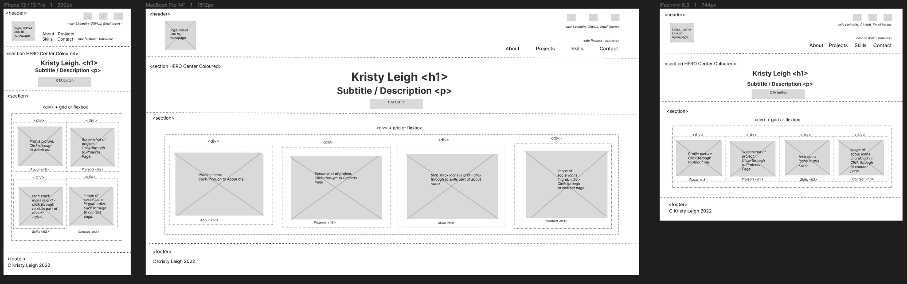
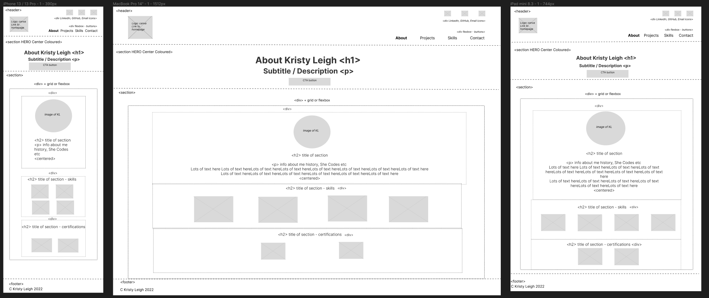
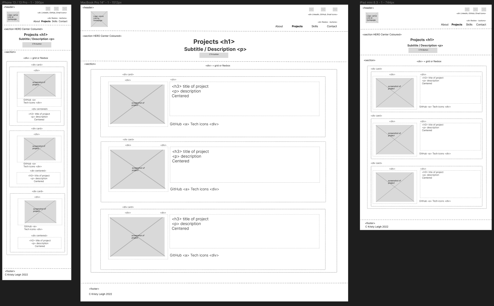
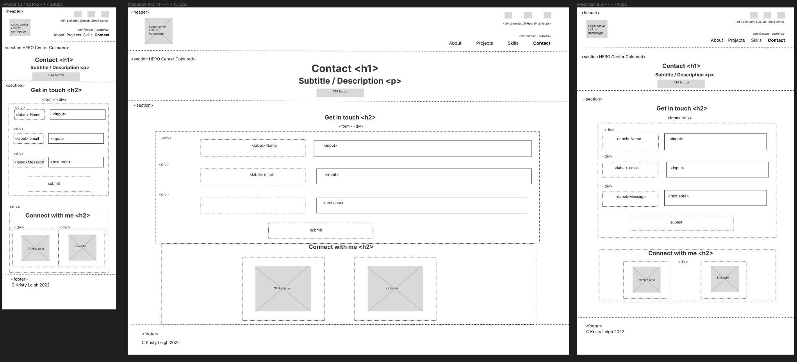
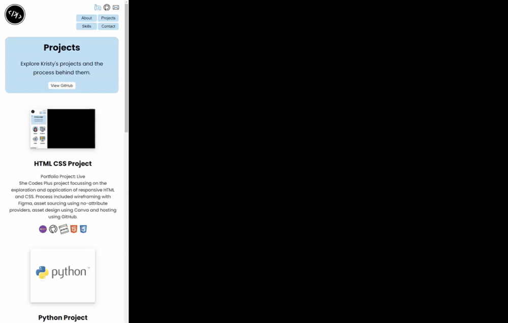
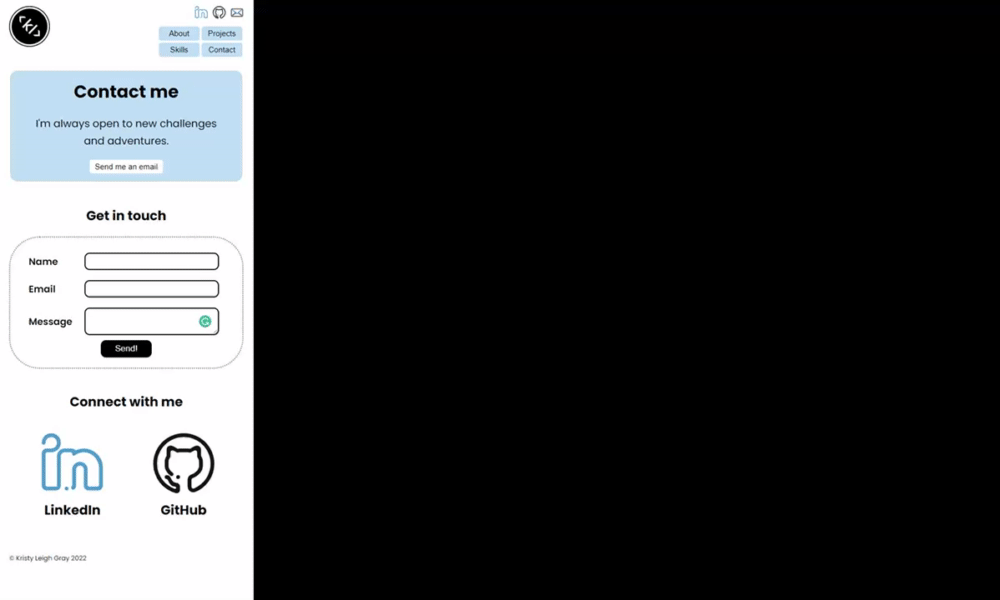

 
<a href="https://ms-kl.github.io/">Kristy Leigh's Portfolio Link</a>
 
 
<h3>About:</h3>
This is portfolio was created by Kristy Leigh using HTML and CSS, as a project for the <b><a href="https://www.shecodes.com.au/">She Codes</a> Plus</b> program.
 
 
<h3>Wireframes:</h3>
Portfolio was designed with responsiveness in mind, using <a href="https://www.figma.com/">Figma</a> wireframe program. Mobile, Tablet and Desktop were considered for each page. Note: Skills nav link points to a section of the about page.

 
<h4><a href="screenshots/wireframe-homepage.png">Home page wireframe</a></h4>

 
<h4><a href="screenshots/wireframe-aboutpage.pdf">About page wireframe</a></h4>

 
<h4><a href="screenshots/wireframe-projects.pdf">Projects page wireframe</a></h4>

 
<h4><a href="screenshots/wireframe-contactpage.pdf">Contact page wireframe</a></h4>

 
<h3>Resources / Attribution Credits:</h3>
All assets have been obtained using no-attribute sources and/or designed myself.
Out of respect for the OG creator(s) please find supplier list below:
<li><a href="https://www.figma.com/">Figma</a>
<li><a href="https://www.reshot.com/free-svg-icons">Reshot</a>
<li><a href="https://imagetocartoon.com/#cartoonize">Image to Cartoon</a>
<li><a href="https://uxwing.com/license/">Uxwing</a>
<li><a href="https://www.canva.com/">Canva</a>
<li><a href="https://www.formspree.com/">Formspree</a>
<li><a href="https://www.gyazo.com/">Gyazo</a>
<li><a href="https://www.shecodes.com.au/">She Codes</a>
<li><a href="https://fonts.google.com/">Google Fonts</a>

 
<h3>Website CSS & Responsiveness:</h3>
All portfolio pages have been designed with media queries and specifically chosen elements to ensure responsiveness across all devices. Please find demo gifs below for each page.

 
<h4>Home Page</h4>

 
<h4>About Page</h4>

 
<h4>Project Page</h4>

 
<h4>Contact Page</h4>

