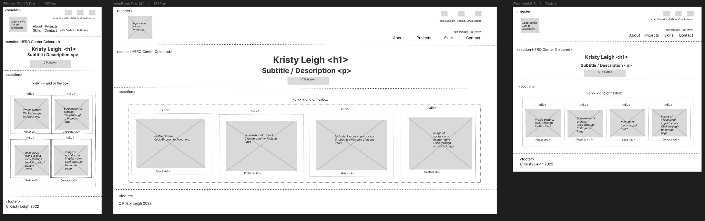
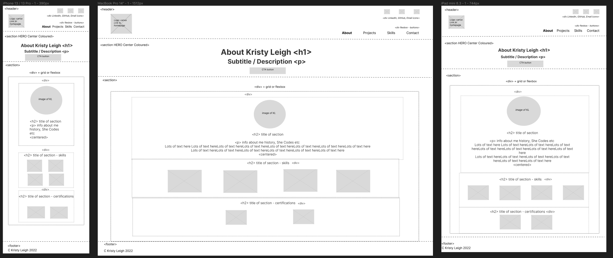
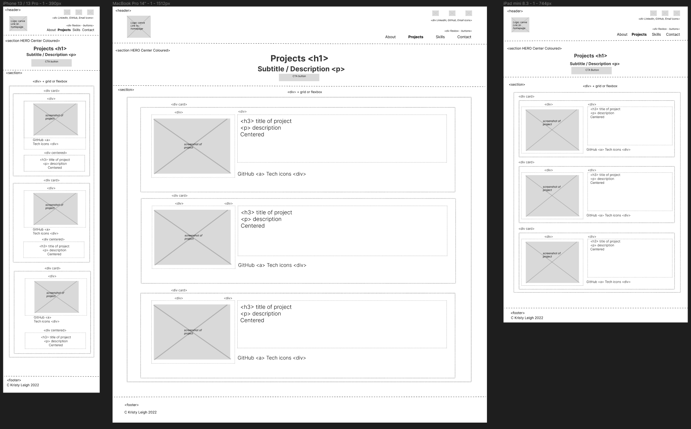
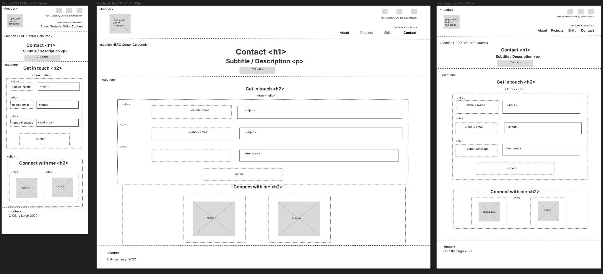

# She Codes Plus Project 1: Portfolio Website (v1)

## About:

This is [portfolio v1](https://ms-kl.github.io/v1/) was created by Kristy Leigh as a project for the [She Codes Plus](https://www.shecodes.com.au/) program.

## Disclaimer:

- Project Submission ([portfolio v1](https://ms-kl.github.io/v1/)) was created by me, Kristy Leigh.

## Tech & Skills Learned:

- HTML
- CSS
- Canva (graphics)
- VS Code
- Github Desktop
- Figma
- Wireframing

## Demo:

<a href="https://www.loom.com/share/4047b062ce334fd9ae27f65ce788a522">
    
Kristy Leigh • Portfolio v1 • Front End Demo - Watch Video

    
  </a>

## Wireframes:

All portfolio pages have been designed with media queries and specifically chosen elements to ensure responsiveness across all devices. Mobile, Tablet and Desktop wireframes were created with
[Figma](https://www.figma.com/).

1. Home page
   

2. About page
   

3. Projects page
   

4. Contact page
   

## Resources / Attribution Credits:

All assets have been obtained using no-attribute sources and/or designed myself.
Out of respect for the OG creator(s) please find supplier list below:

- [Figma](https://www.figma.com/)
- [Reshot](https://www.reshot.com/free-svg-icons)
- [Image to Cartoon](https://imagetocartoon.com/#cartoonize)
- [Uxwing](https://uxwing.com/license/)
- [Canva](https://www.canva.com/)
- [Formspree](https://www.formspree.com/)
- [Gyazo](https://www.gyazo.com/)
- [She Codes](https://www.shecodes.com.au/)
- [Google Fonts](https://fonts.google.com/)
